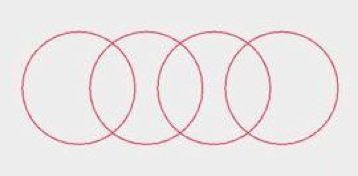
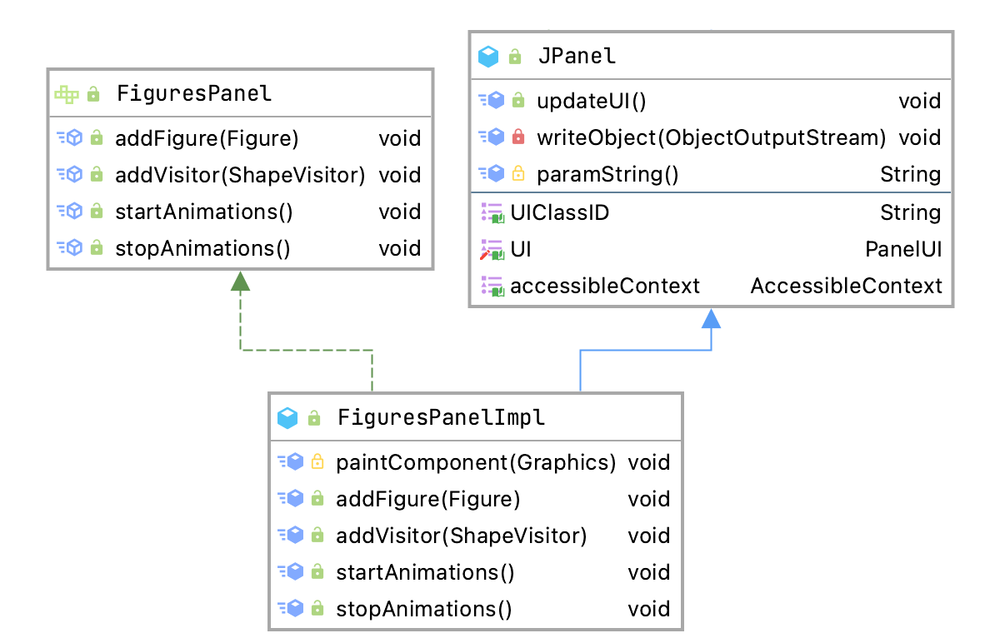

# Animated Figures

A program to animate figures using the visitor pattern as part of a homework in MC404 WS2021 at [FH OÖ Campus Hagenberg](https://www.fh-ooe.at/en/hagenberg-campus).


## 💻 Requirements
* Java 15 (with preview features)

## 🚀 Get Started
```bash
./gradlew run
```

## Architecture

Most of the architecture is already given in the assignment. Therefore, only certain aspects are covered.


### Shape

A shape is the base class for all figure and also simple shapes. It supports methods to resize, move and to paint itself. The simplest shape is the `BaseShape` with two concrete implementations of a rectangle and a circle.

#### Figure

A figure itself consists of multiple shapes like rectangles or circles. The two implemented figures are a magnifier


and a chain (with a lot of imagination).



### Decorators
This class passes all calls to the decorated object and also the call of the visitors to the actual figure. At the moment there exists two decorators:

* BackgroundDecorator: Adds a rectangle to the background of the figure.
* BorderDecorator: Adds a border to the figure.

### Visitors

Visitors are the central place of the animations. To keep track of the current move direction (e.g. left or right in the `HorizontalMoveVisitor`) every visitor has a `HashMap<Figure, Direction>`. A possible implementation can look like this:

```java
var direction = Direction.RIGHT;
if (visitedFigures.containsKey(figure)) {
  direction = visitedFigures.get(figure);
}
```

The three visitor are:

* VerticalMoveVisitor: Moves the figure on the y-axis.
* HorizontalMoveVisitor: Moves the figure on the x-axis.
* ResizeVisitor: Shrinks or expands the figure.

### FiguresPanel

The `FiguresPanelImpl` is a subclass of a `JPanel` and provides methods to add figures and visitors. Furthermore, it contains the logic to start the animations using threads.



